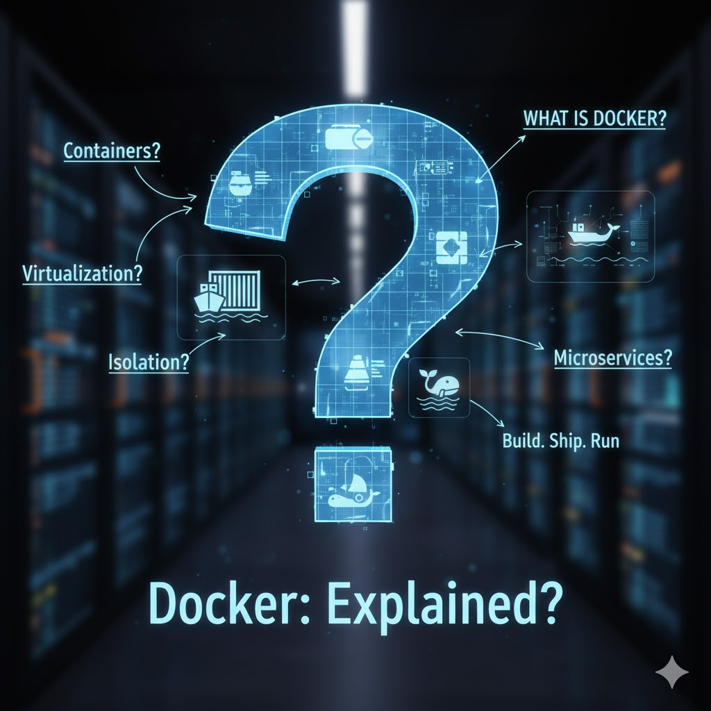
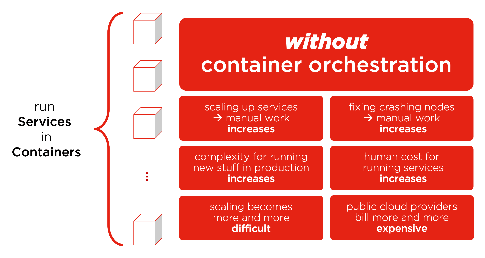
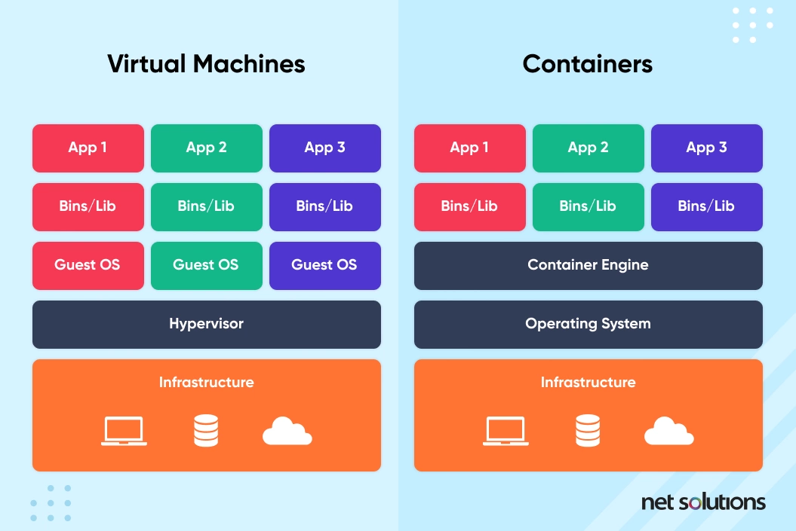
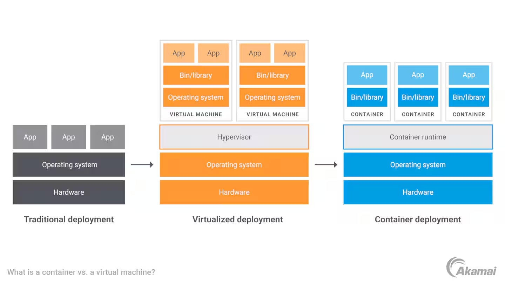
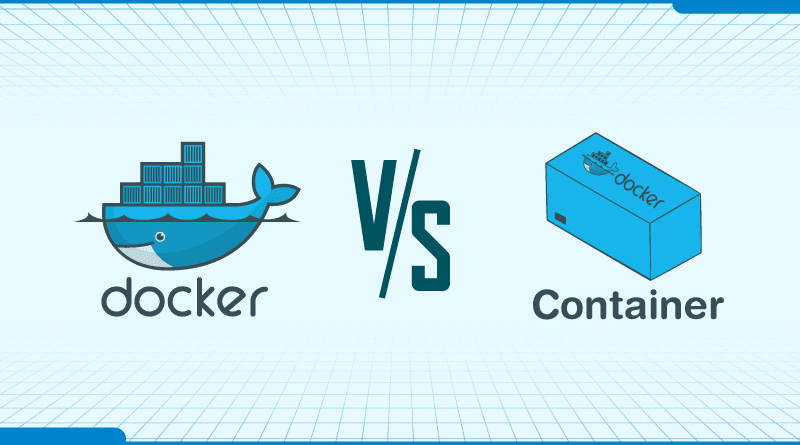
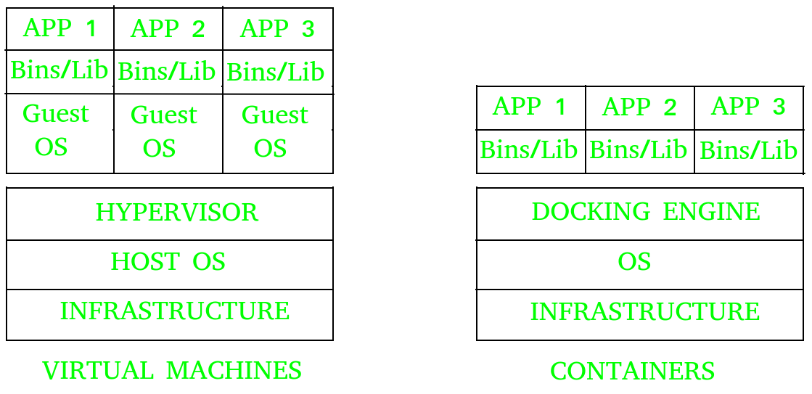
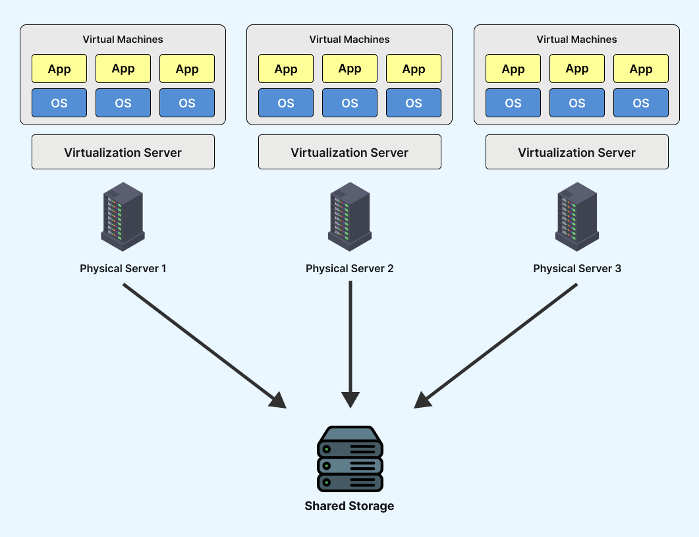
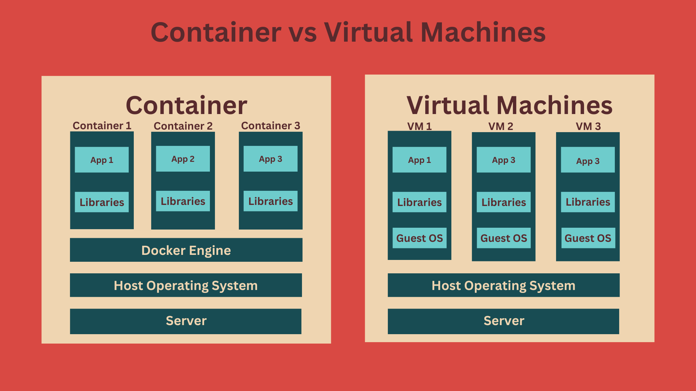
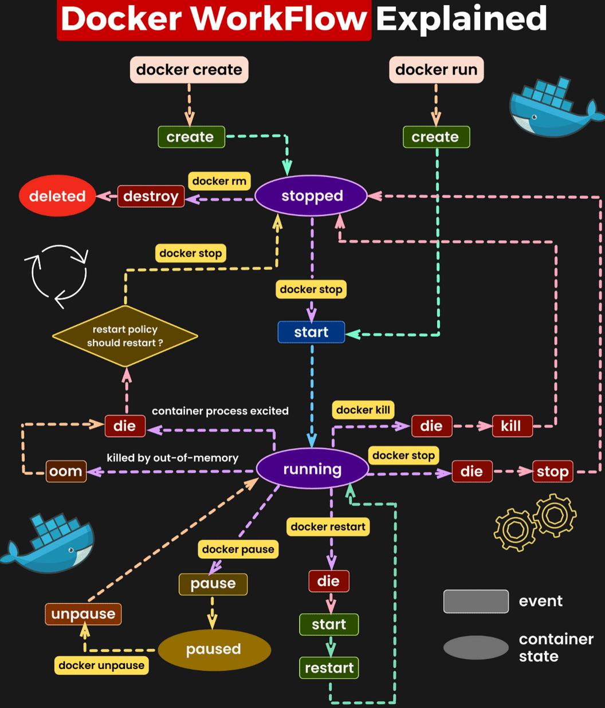

#  Day-01: Docker Vs Virtual Machine 

## 🔹 What is Docker?

Before understanding **Docker**, let’s look at the **traditional way of deploying applications** and the **challenges** we faced.

---

###  Traditional Deployment Challenges



Let’s say you have **three environments** — **Development**, **Testing**, and **Production**.  
A developer writes some code and pushes it to a **version control system** like GitHub. The code is built and deployed into the **Dev environment**, and everything works fine.

When promoted to **Test**, it still works — great!  
But when deployed to **Production**, it fails.

This happens due to:
- Environment **misconfiguration**
- **Missing dependencies**
- Library version mismatches  
- Or other inconsistencies between environments

---

###  “It works on my machine!”


The developer says: “It works on my machine.”  
The **Operations** team says: “It’s an infrastructure issue.”

This back-and-forth creates friction.  
Before **Docker**, there was **no easy way to package dependencies, libraries, configurations, and code together** so that it runs consistently across all environments.

That’s where **containers** come in.

---

##  Why Containers?



With **containers**, we now **package everything** — application code, library versions, dependencies, and even the operating system image.  
This ensures the application works the **same in every environment**, including **Production**.

This eliminates issues caused by configuration mismatches or infrastructure differences.

✅ **Developers are happy.**  
✅ **Ops teams are happy.**  
✅ **Everyone is happy.**

---

## 🧱 What Exactly Is a Container?



A **container** bundles:
- All **dependencies**
- All **libraries**
- The **application code**

It guarantees **environment consistency**, regardless of the **Operating System (OS)** underneath — whether it’s **Ubuntu**, **CentOS**, or **RedHat Linux**.

Containers are:
- **Isolated environments** (also called **sandboxed**)
- **Lightweight** because they include only the essential OS components

The **goal of a container** is simple:
> **Build → Ship → Run**

---

##  Docker vs Container



**Docker** is a **platform** that helps you **build, ship, and run containers**.  
It’s the most popular containerization tool, though alternatives like **Podman** also exist.

---

##  Containers vs Virtual Machines (VMs)





| Feature | Virtual Machine | Container |
|----------|----------------|------------|
| Isolation | Runs full OS | Shares host OS kernel |
| Resources | Heavy (entire OS per VM) | Lightweight |
| Speed | Slower startup | Fast startup |
| Efficiency | Resource waste | Optimized resource usage |

### Example:
- A **VM** is like a **house** — it has its own complete setup.
- A **Container** is like an **apartment in a building** — shared infrastructure, isolated spaces.

**Docker** helps use infrastructure **more efficiently** by sharing resources across containers while maintaining isolation.

---

##  How VMs Work



In traditional virtualization:
- You have a **physical server**
- A **hypervisor** (like VMware, VirtualBox, or KVM)
- Multiple **guest OS instances** (Ubuntu, Fedora, RedHat, etc.)

Each VM runs its own OS, libraries, and applications — consuming significant resources.

---

##  How Containers Work





Instead of a hypervisor, containers use a **container engine** (like **Docker Engine**) that runs **multiple containers** on the same OS.

Advantages:
- **Lightweight alternative** to VMs  
- **Shared OS kernel**
- **Efficient & portable**

---

##  Docker Workflow



### Key Components:
- **Dockerfile** → Defines how to build an image
- **Docker Image** → Packaged application + dependencies
- **Docker Container** → Running instance of the image
- **Docker Registry** → Storage for images (like **Docker Hub**, **AWS ECR**, **GCP Artifact Registry**)

```bash
echo "Thanks For the Visiting"
```